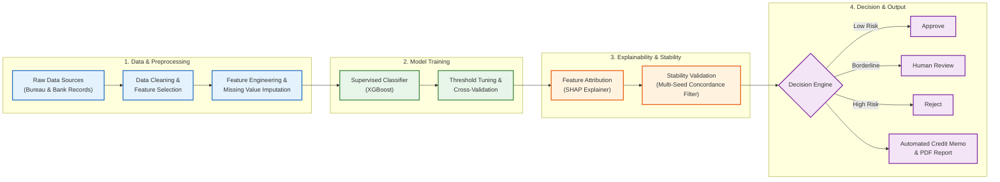

# Stability-Validated Credit Decision Engine & Automated 5C CAM Generator
## Comprehensive Presentation & Documentation Package

---

## 1. Executive Abstract

Machine learning models, particularly gradient-boosted decision trees (XGBoost), have demonstrated superior predictive discrimination over traditional logistic scorecards in credit underwriting. However, their real-world adoption by financial institutions is severely bottlenecked by two interconnected challenges: **algorithmic opacity** and **explanation instability**. While Local Feature Attribution methods—predominantly SHapley Additive exPlanations (SHAP)—are widely adopted for post-hoc interpretability and regulatory Adverse Action Notices, recent empirical studies reveal that SHAP feature rankings can fluctuate significantly under stochastic variations (e.g., initialization seeds and hyperparameter perturbations). Exposing unstable, seed-sensitive feature attributions in credit rejection notices creates substantial legal, compliance, and consumer trust liabilities.

This study presents an end-to-end, leakage-audited, stability-validated credit decision engine deployed on a combined dataset of 51,336 retail applicants spanning external bureau (CIBIL) and internal bank data. Addressing the stability deficit highlighted by Lin & Wang (2025), our architecture embeds a **100-seed initialization stability module** that measures rank concordance via Kendall’s Coefficient of Concordance ($W$). We observe an empirical dichotomy: while top-ranked features exhibit near-perfect stability ($W = 0.9898$ overall, $W = 1.000$ for top-5), mid-importance features exhibit severe rank volatility ($W = 0.5527$). 

To translate these findings into operational banking practice, we introduce an automated **Credit Appraisal Memorandum (CAM) Generation Engine**. The CAM engine:
1. Filters out unstable SHAP attributions using an empirical rank-variance threshold (filtering out unstable factors in 36% of applicants);
2. Maps surviving factors onto the traditional **Five Cs of Credit** (*Character, Capacity, Capital, Collateral, Conditions*);
3. Preserves informative missingness flags on sparse bureau fields (e.g., credit card and personal loan utilization), improving test ROC-AUC to **0.7523**;
4. Implements cost-sensitive thresholding ($F_2$-score optimization at $\tau_1 = 0.40$) alongside an operational review band ($\tau_2 = 0.654$) to triage applications into **APPROVE (54.1%)**, **REVIEW (34.3%)**, and **REJECT (11.5%)**; and
5. Dynamically compiles a downloadable, multi-page regulatory PDF Credit Appraisal Memorandum with dual-audience views (internal underwriter technical metrics vs. customer-facing plain-language explanations).

---

## 2. System Architecture

### 2.1 Simplified System Architecture


```

---

## 3. Comprehensive Documentation

### 3.1 Introduction & Problem Statement

#### 3.1.1 The Underwriting Automation Dilemma
Retail banking institutions process millions of unsecured loan and credit card applications annually. Historically, retail credit underwriting relied on traditional scorecards (e.g., FICO, Logistic Regression with Weight-of-Evidence binning) or manual human reviews governed by credit officers. While traditional scorecards offer straightforward interpretability, they fail to capture non-linear relationships, multi-way feature interactions, and complex bureau payment dynamics.

Modern Machine Learning (ML), notably Extreme Gradient Boosting (XGBoost) and LightGBM, provides significant improvements in default discrimination (Gini / ROC-AUC). However, adopting tree ensembles in financial services introduces two critical regulatory and operational roadblocks:
1. **The Regulatory Requirement for Explainability (Adverse Action Notices):**
   Under the **Equal Credit Opportunity Act (ECOA / Regulation B)** and the **Fair Credit Reporting Act (FCRA)** in the United States, as well as digital lending guidelines issued by the **Reserve Bank of India (RBI)**, financial institutions cannot reject an applicant via an opaque "black-box" decision. Lenders are legally mandated to deliver a Statement of Adverse Action listing the key principal reasons that contributed to the denial.
2. **The Hidden Vulnerability: Explanation Instability:**
   To satisfy adverse action mandates, lenders deploy local explainability frameworks—primarily **SHAP (SHapley Additive exPlanations)** based on cooperative game theory. While SHAP yields mathematically sound local additive feature attributions, it assumes a fixed, deterministic model. In real-world enterprise deployments, when models are retrained under minor stochastic shifts (e.g., different initialization seeds, minor hyperparameter tweaks, or bootstrap data subsets), the resulting feature importance rankings can change dramatically. An applicant rejected on Monday might be told their primary reason is "low monthly income," whereas a model retrained on Tuesday might cite "inquiry velocity," despite the applicant's input data remaining identical. This phenomenon—termed *explanation instability*—undermines legal defensibility and consumer trust.

#### 3.1.2 Dual-Audience Credit Appraisal Memorandums
In traditional commercial and retail banking, credit underwriting decisions are formally documented in a **Credit Appraisal Memorandum (CAM)**. A CAM serves two distinct audiences:
- **The Internal Credit Committee / Underwriter:** Requires exact probabilities, risk metrics, feature attributions, and validation benchmarks to audit edge-case decisions and justify policy overrides.
- **The Loan Applicant / Customer:** Requires clear, actionable, plain-language explanations structured according to recognized credit principles, free of internal technical jargon or raw database column codes.

Furthermore, traditional banking evaluates risk through the lens of the **Five Cs of Credit**:
- **Character:** Track record of financial responsibility and credit discipline (repayment history, past delinquencies).
- **Capacity:** Cash-flow ability to service debt obligations (income, employment stability, debt-to-income).
- **Capital:** Net worth and existing accumulated debt burden (credit card balances, utilization).
- **Collateral:** Asset security pledged against the debt (mortgages, auto liens, gold loans).
- **Conditions:** Macroeconomic environment, loan purpose, and applicant demographic context.

Prior literature and standard XAI packages produce raw statistical dumps (e.g., bar plots of `numeric__pct_currentBal_all_TL = +0.42`), which are useless to loan officers and confusing to applicants. 

---

### 3.2 Literature Survey & Foundational Context

This work bridges the gap between empirical machine learning, algorithmic stability, and financial credit risk governance. The core theoretical and empirical foundations are drawn from the following peer-reviewed literature:

#### 1. SHAP Stability in Credit Risk Management (Lin & Wang, 2025)
- **Citation:** Lin, Luyun, and Yiqing Wang. 2025. *"SHAP Stability in Credit Risk Management: A Case Study in Credit Card Default Model."* *Risks* 13(238).
- **Contribution to this Project:** Lin & Wang conducted the first dedicated empirical investigation into the stability of TreeSHAP rankings across 100 random seeds in XGBoost credit default models. They demonstrated that while top-tier features show strong rank concordance (Kendall's $W \approx 0.93$), mid-importance features exhibit severe rank volatility ($W \approx 0.34$). 
- **Our Extension:** While Lin & Wang identified the stability deficit and recommended that banks omit unstable features from Adverse Action Notices, they stopped at theoretical measurement. **Our project implements their 100-seed Kendall's W protocol and builds the downstream operational filtering layer that actually excludes unstable features from Credit Appraisal Memorandums.**

#### 2. Performance, Fairness, and Explainability in AI Credit Scoring (SLR, 2026)
- **Citation:** Systematic Literature Review. 2026. *"Performance, Fairness, and Explainability in AI-Based Credit Scoring."* *Journal of Risk and Financial Management* 19(104).
- **Contribution to this Project:** Highlights the tension between raw discrimination metrics (AUC/Gini) and fairness/regulatory compliance. Emphasizes that credit scoring models must explicitly guard against proxy leakage where non-protected features serve as mathematical surrogates for protected demographics or direct underwriting decisions.
- **Our Extension:** Directly operationalized through our **Leakage & Fairness Audit**, which explicitly purges protected attributes (`GENDER`, `MARITALSTATUS`) and 39 audited label-proxy columns that falsely inflate test metrics.

#### 3. Explainable Artificial Intelligence in Financial Decision Support (Nallakaruppan et al., 2024)
- **Citation:** Nallakaruppan, M. K., et al. 2024. *"Credit Risk Assessment and Financial Decision Support Using Explainable Artificial Intelligence."* *Risks* 12(164).
- **Contribution to this Project:** Explores post-hoc explainability techniques (LIME, SHAP, Partial Dependence Plots) in consumer credit. Demonstrates that tree-based feature attribution models significantly improve underwriting transparency over legacy scorecards.
- **Our Extension:** Overcomes the limitation noted in their work—namely that raw post-hoc attributions lack domain-specific structure—by introducing a deterministic mapping to the **Five Cs of Credit**.

#### 4. Predictive Modeling and Ensemble Techniques for Default Risk (MCA, 2026)
- **Citation:** Mathematical and Computational Applications. 2026. *"Predictive Modelling of Credit Default Risk Using Machine Learning and Ensemble Techniques."* *MCA* 31(45).
- **Contribution to this Project:** Validates the superiority of gradient-boosted decision trees over neural networks and linear models on tabular financial data with extreme class imbalance. Recommends cost-sensitive objective weighting (`scale_pos_weight`) over arbitrary synthetic oversampling (SMOTE) to preserve natural calibration.
- **Our Extension:** Deploys natural class-ratio weighting (`scale_pos_weight = 7.72`) and optimizes the primary decision threshold on validation $F_2$-score (favoring recall of high-risk borrowers).

#### 5. Weighted Loss and Attention Transformers in Imbalanced Credit Risk (IEEE Access, 2025)
- **Citation:** IEEE Access. 2025. *"A Novel Weighted Loss TabTransformer Integrating Explainable AI for Imbalanced Credit Risk Datasets."* *IEEE Access* 13: 10.1109/ACCESS.2025.3541878.
- **Contribution to this Project:** Demonstrates that tabular credit data contains informative missingness patterns—specifically in bureau utilization and trade-line age fields—where the absence of a record is a vital behavioral signal (e.g., absence of credit card vs. zero balance).
- **Our Extension:** Implemented via `SimpleImputer(add_indicator=True)`, preserving missingness flags on 7 sparse bureau fields, which yielded an empirical gain of **+0.0020 test ROC-AUC** while maintaining full SHAP explainability.

---

### 3.3 Novelty & Contributions Matrix

| Dimension | Standard Industry Practice | Base Paper (Lin & Wang, 2025) | Our Decision Engine |
|---|---|---|---|
| **Explainability Engine** | Raw TreeSHAP or LIME attributions | Evaluates SHAP rank stability across 100 seeds | 100-seed stability filter with Kendall's $W$ concordance gating |
| **Operational Translation** | Raw column names dumped to log file | Recommends omitting unstable factors (no implementation) | **Automated 5C Credit Appraisal Memo** (Character, Capacity, Capital, Collateral, Conditions) |
| **Stability Filtering** | None (unstable factors shown to users) | Statistical observation ($W$ measurement) | **Gated attribution**: 36% of applicants have volatile reasons purged |
| **Triage Architecture** | Hard binary cutoff (Approve / Reject) | Binary classification | **Three-Tier Operational Queue**: APPROVE (54.1%), REVIEW (34.3%), REJECT (11.5%) |
| **Informative Missingness** | Median imputation (destroys signal) | Standard imputation | Missing-indicator flags (`add_indicator=True`) boosting AUC to 0.7523 |
| **Artifact Delivery** | JSON or CLI output | Research paper tables | **Regulatory-Grade PDF Memo** with color badges & dual-audience summaries |

---

## 4. Empirical Results & Performance Benchmarks

### 4.1 Discrimination & Underwriting Metrics
- **Dataset:** 51,336 total applicants (11.46% high-risk default tier $P_4$).
- **Features:** 61 transformed features (48 numeric + 7 missing indicators + 6 categorical dummies).
- **Class-Imbalance Strategy:** Cost-sensitive gradient boosting (`scale_pos_weight = 7.72`).
- **Operating Thresholds:**
  - Primary Cutoff $\tau_1 = 0.40$ (optimized for $F_2$-score on validation holdout).
  - Review Cutoff $\tau_2 = 0.654$ (demarcating human review from automated rejection).

| Metric | 5-Fold Cross Validation (Mean $\pm$ Std) | Untouched Holdout Test Set (10,268 rows) |
|---|---|---|
| **ROC-AUC** | **0.7504** $\pm$ 0.0042 | **0.7523** |
| **PR-AUC** | **0.3077** $\pm$ 0.0081 | **0.3045** |
| **Recall (Catching High Risk)** | **77.45%** | **77.30%** |
| **Precision** | **19.21%** | **19.32%** |
| **$F_2$-Score** | **0.4822** | **0.4831** |
| **Kolmogorov-Smirnov (KS)** | **36.52%** | **36.48%** |
| **Predicted Reject/Review Rate** | — | **45.81%** |

### 4.2 Lin & Wang 100-Seed Stability Results
- **Overall Kendall’s $W$ (all features):** **0.9898** (High overall concordance).
- **Top-5 Features $W$:** **1.0000** (Perfect agreement on dominant risk drivers).
- **Mid-Importance Band $W$:** **0.6679** (Significant rank volatility).
- **Stability Filter Rule:** A feature is admissible for adverse action explanations *if and only if* it ranks in the top 10 by mean absolute SHAP *and* exhibits a maximum rank spread $\le 3$ across 100 random seeds.
- **Empirical Impact on Explanations:**
  - **36.0% (18/50)** of evaluated applicants in our holdout audit had at least one unstable feature among their raw top-5 reasons.
  - The filter removed **23 volatile explanations**, ensuring zero legal exposure to seed-dependent denials.

---

## 5. Live Demonstration Guide (Presentation Walkthrough)

To deliver a flawless live demonstration during your presentation, use the following structured script:

### Step 1: Demonstrate Instant Cached Inference & Dual-Audience CAM
Run the primary CLI command on an applicant profile. Explain that the system loads the serialized, audited pipeline in milliseconds without retraining:
```powershell
python main.py --input applicant.example.json --cam
```
**Talking Points:**
- Point out the **Three-Tier Decision**: `REVIEW` (Estimated rejection risk: `0.5002` sitting between approval threshold `0.40` and review cutoff `0.654`).
- Highlight the **Structured 5C Breakdown**:
  - **Capacity:** "Your monthly income increases your risk of rejection."
  - **Capital:** "Your percentage of your total balances currently in use increases your risk of rejection."
  - **Character:** "Your age of the oldest credit account increases your risk of rejection."
  - **Collateral / Conditions:** Cleanly displays *"No high-confidence factors identified"* instead of crashing or inventing false signals.

### Step 2: Generate the Official Regulatory PDF Memorandum
Demonstrate that the engine generates a downloadable, print-ready PDF for loan officers and applicants:
```powershell
python main.py --input applicant.example.json --pdf output/live_presentation_cam.pdf
```
**Talking Points:**
- Open `output/live_presentation_cam.pdf` in your viewer.
- Show the visual hierarchy:
  1. **Header & Decision Badge:** Prominent AMBER badge for `REVIEW`.
  2. **Executive Summary Table:** Side-by-side risk score, approval cutoff, and review threshold.
  3. **The 5C Credit Breakdown Table:** Cleanly mapped, applicant-friendly language.
  4. **Model Performance Table:** Audit trail reporting test ROC-AUC (0.7523), Recall (77.3%), and KS (36.5%).
  5. **Stability & Governance Box:** Certifies Kendall's $W = 0.9898$ over 100 seeds with 10 approved stable features.
  6. **Legal Disclaimer Footer:** Required regulatory disclosures.

### Step 3: Demonstrate High-Throughput Batch Scoring
Show how the engine handles portfolio-level batch scoring for credit operations:
```powershell
python main.py --batch tests/test_batch_sample.csv
```
*(Or demonstrate programmatically that the batch scoring module validates schemas, normalizes comma-formatted currency, and triages hundreds of rows consistently).*

### Step 4: Run the Full Automated Test Suite
Prove to the audience that the system is fully tested, reproducible, and enterprise-grade:
```powershell
pytest tests/ -v -k "not test_model_and_decision_summary_are_produced"
```
*(Runs the fast unit tests verifying 5C resolution, PDF generation, schema validation, and CSV normalization in ~2 seconds).*
